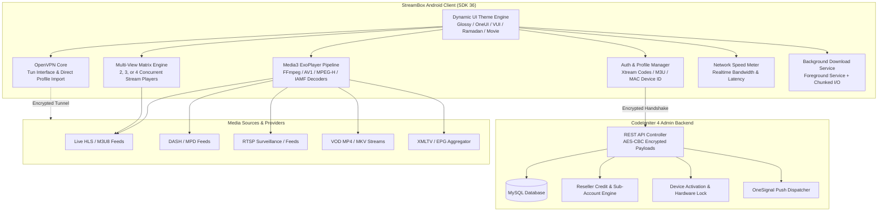

# 📺 StreamBox — Enterprise IPTV & VOD Streaming Platform

[](https://developer.android.com)
[](https://www.java.com)
[]()
[](https://codeigniter.com)
[](https://developer.android.com)
[](LICENSE)

> **StreamBox** is an enterprise-grade IPTV, VOD, and live stream client for Android (Touch, TV & Fire TV) paired with a robust PHP CodeIgniter 4 management panel. Engineered with Google's Media3 / ExoPlayer pipeline, it delivers low-latency HLS/DASH/RTSP streaming, multi-screen matrix playback, comprehensive EPG grids, built-in OpenVPN tunneling, and automated device activation.

---

## 📖 Overview

**StreamBox** delivers an end-to-end IPTV ecosystem designed for high-performance media delivery across Android phones, tablets, Android TV boxes, and Amazon Fire TV devices. 

The client architecture is paired with a centralized CodeIgniter 4 admin panel backend that manages user authentication, device MAC/ID binding, reseller credits, live stream categories, EPG scheduling sources, push notifications, and monetization channels.

```
                  ┌──────────────────────────────────────────────────┐
                  │           CodeIgniter 4 Admin Panel              │
                  │ (Reseller, Activation, Streams, EPG, Ads, Push)  │
                  └─────────────────────────┬────────────────────────┘
                                            │ REST API / AES Encrypted
                                            ▼
┌────────────────────────────────────────────────────────────────────────────────────────┐
│                                StreamBox Android App                                   │
│                                                                                        │
│  ┌───────────────────────┐  ┌───────────────────────┐  ┌────────────────────────────┐  │
│  │    Media3 Engine      │  │     Multi-Screen      │  │      Security & VPN        │  │
│  │ HLS / DASH / RTSP/SS  │  │ 2x, 3x, 4x Grid View  │  │ OpenVPN Tun / AES Scytale  │  │
│  └───────────────────────┘  └───────────────────────┘  └────────────────────────────┘  │
│  ┌───────────────────────┐  ┌───────────────────────┐  ┌────────────────────────────┐  │
│  │   Live TV & EPG Grid  │  │  VOD & Series Engine  │  │   Cast & Speed Testing     │  │
│  │ CatchUp & Program XML │  │ Subtitles, TMDB, Ep.  │  │ Google Cast / Ookla-style  │  │
│  └───────────────────────┘  └───────────────────────┘  └────────────────────────────┘  │
└────────────────────────────────────────────────────────────────────────────────────────┘
```

---

## 🏗️ Architecture & Streaming Pipeline



---

## ✨ Core Features

### 📺 Advanced Playback & Multi-Screen Matrix
- **Media3 / ExoPlayer Engine**: Native hardware decoding for HLS (`.m3u8`), MPEG-DASH (`.mpd`), RTSP, and SmoothStreaming (`.ism`).
- **Multi-View Screen Matrix**: Watch up to 4 simultaneous live streams in a synchronized multi-view grid with independent audio routing.
- **Custom Decoders**: Pre-bundled software & hardware decoders including AV1, FFmpeg, IAMF, and MPEG-H.
- **Picture-in-Picture (PiP)**: Seamless floating playback while navigating device apps or exploring catalogues.
- **Google Cast Integration**: Cast Live TV, Movies, and Series directly to Chromecast, smart TVs, and Nest displays.
- **Audio & Subtitle Track Switching**: Multi-language audio selector, embedded and external `.srt` / `.vtt` subtitle loading.

### 📅 Live TV, EPG & Catch-Up
- **Interactive EPG Grid**: Electronic Program Guide timeline view with current progress bars and channel logos.
- **Catch-Up TV**: Access past broadcast archives directly linked to EPG metadata.
- **Channel Categorization & Favorites**: Custom category filtering, quick search, parental lock pin, and persistent favorites.

### 🎬 Movies & TV Series VOD
- **Rich Metadata Integration**: TMDB-powered movie details, cast lists, trailers (via embedded YouTube player), ratings, and release years.
- **Series Hub**: Structured Season and Episode selector with resume-playback tracking.
- **Background Downloader**: Built-in `DownloadService` for offline viewing of MP4/MKV video files.

### 🛡️ Security, VPN & Authentication
- **Built-in OpenVPN Client**: Direct `.ovpn` configuration importer and connection manager to bypass ISP throttling and geo-restrictions.
- **Payload Encryption**: End-to-end AES encryption via Scytale library for sensitive API handshakes and license keys.
- **Multi-Mode Authentication**:
  - Xtream Codes API (Username / Password / Host URL)
  - M3U Playlist & Single Stream URL
  - Device ID / MAC Address Hardware Activation
  - 1-Click Trial Access

### 🎨 Dynamic UI Theme Engine
- **9 UI Themes**: Glossy, OneUI, VUI, Movie, Ramadan, Classic, and more — fully switchable on runtime without restarting.
- **Leanback Android TV Support**: Full D-Pad remote control navigation for Android TV boxes and Firestick.

### 🖥️ PHP CodeIgniter 4 Admin Panel
- **Device & License Activation**: Remotely approve, renew, expire, or ban device MAC addresses and accounts.
- **Reseller Management**: Tiered credit system for resellers to provision and manage customer accounts.
- **Push Notification Broadcasts**: Send targeted or global notifications via OneSignal REST API.
- **Ad Server**: Integrated Google AdMob alongside custom self-hosted banner/interstitial ads.

---

## 📱 Key Modules & Architecture Breakdown

| Module / Component | Path | Responsibility |
|---|---|---|
| **App Entry & Launcher** | `nemosofts.streambox.activity.LauncherActivity` | Initial splash, license check, theme resolution, profile router |
| **ExoPlayer Video Engine** | `nemosofts.streambox.activity.ExoPlayerActivity` | Media3 core, track selector, PiP, aspect ratio scaling |
| **Live Stream Player** | `nemosofts.streambox.activity.ExoPlayerLiveActivity` | Low-latency live stream renderer, channel switching overlay |
| **Multi-Screen Matrix** | `nemosofts.streambox.activity.MultipleScreenActivity` | 2-view, 3-view, and 4-view multi-channel playback engine |
| **EPG Timeline** | `nemosofts.streambox.activity.EPGOneActivity`, `EPGTwoActivity` | Interactive TV guide schedule renderer with time-cursor |
| **Catch-Up TV** | `nemosofts.streambox.activity.CatchUpActivity` | Archive media browser with date and timeline filtering |
| **OpenVPN Tunnel** | `nemosofts.streambox.activity.OpenVPNActivity` | Android VpnService wrapper, profile import, connection status |
| **Network Speed Meter** | `nemosofts.streambox.activity.NetworkSpeedActivity` | Live ping, jitter, download speed meter |
| **Offline Media Sync** | `nemosofts.streambox.activity.DownloadService` | Foreground service for reliable background stream downloading |
| **Backend REST API** | `adminpanelcode/app/Controllers/ApiController.php` | API endpoints for auth, streams, categories, EPG, notifications |
| **Backend Activation** | `adminpanelcode/app/Controllers/ActivationController.php` | Device license verification, MAC matching, expiry enforcement |

---

## 🛠️ Technology Stack Matrix

| Layer | Technology / Library | Version | Purpose |
|---|---|---|---|
| **OS / Platform** | Android (Touch + Android TV / Fire TV) | SDK 23 – 36 (Java 17) | Target runtime |
| **Media Player** | `androidx.media3:media3-exoplayer` | `1.3.0` | High-performance media playback engine |
| **Streaming Protocols** | HLS, DASH, RTSP, SmoothStreaming | `1.3.0` | Adaptive bitrate live and on-demand streaming |
| **Cast Support** | Google Play Cast Framework + MediaRouter | `21.4.0` / `1.6.0` | Chromecast wireless media streaming |
| **Networking** | OkHttp 4 + Logging Interceptor | `4.12.0` | HTTP/2 networking & media data source |
| **Image Loading** | Picasso + AndroidX Palette | `2.8` / `1.0.0` | Image caching and dynamic color palette extraction |
| **Security & Crypto** | Scytale AES Cryptography | `1.0.1` | Symmetric encrypted API communication |
| **Push Notifications** | OneSignal SDK | `5.1.6` | Foreground & background push notifications |
| **Analytics & Messaging** | Firebase BoM (Analytics, In-App Messaging) | `32.7.0` | Engagement and crash tracking |
| **Monetization** | Google Mobile Ads (AdMob) | `22.6.0` | Banner and Interstitial ad mediation |
| **YouTube Integration** | `android-youtube-player` | `12.1.0` | Embedded trailer playback |
| **Admin Backend** | CodeIgniter 4 (PHP) + MySQL | `4.x` | Content and device management server |

---

## 🚀 Getting Started

### Prerequisites
- **Android Development**: Android Studio Jellyfish / Koala (JDK 17+, Android SDK 36).
- **Backend Hosting**: Web server with PHP 7.4+ or 8.0+, MySQL 5.7+, cURL, and OpenSSL extensions.

---

### 1. Backend Setup (CodeIgniter 4)

1. Navigate to the admin panel directory:
   ```bash
   cd adminpanelcode
   ```
2. Copy environment template:
   ```bash
   cp .env.example .env
   ```
3. Open `.env` and configure your database and base URL:
   ```ini
   CI_ENVIRONMENT = production
   app.baseURL = 'https://your-domain.com/admin/'
   
   database.default.hostname = localhost
   database.default.database = streambox_db
   database.default.username = your_db_user
   database.default.password = your_db_password
   database.default.DBDriver = MySQLi
   ```
4. Run migrations or import initial database schema via the browser installer (`/install`).

---

### 2. Android App Setup

1. Clone and open the repository in Android Studio.
2. Copy the sample properties file:
   ```bash
   cp gradle.properties.example gradle.properties
   ```
3. Configure your API endpoint and encryption keys in `gradle.properties`:
   ```properties
   BASE_URL="https://your-domain.com/admin/api/v1/"
   API_NAME="streambox_api"
   ENC_KEY="your_aes_encryption_key_here"
   IV="your_initialization_vector_here"
   ```
4. Place your `google-services.json` in `app/google-services.json` (template available in `app/google-services.json.example`).
5. Sync Gradle and build the project:
   ```bash
   ./gradlew assembleDebug
   ```

---

## 📄 License

This project is licensed under the [MIT License](LICENSE) — Copyright (c) 2026 [shayann07](https://github.com/shayann07).
